# React Native Deliver App 

This is a simpler React Native Deliver App with Expo App

To run the project, check out the [deliverApp](.).

</br></br>
**Build a consistent, deliver-app with react native in minutes.**
</br>
</br>

This is my Deliver mobile app, a React Native project done with Expo.
[Demo Video](https://youtu.be/aO9aBHwYvNE)

</br>
</br>
This is my Airbnb Clone mobile app React Native project done with expo.

## Installation

Add the package to your project using one of the following:

```bash
npm install
```

```bash
npx expo
```

```bash
yarn add
```

## Running the Documentation site locally

To run the Documentation site locally, please follow the steps below:

1. `cd deliverApp`
2. `npm install`
3. `npx expo`
4. Press the w button and Go to http://localhost:3000/deliverApp/ or press the a button open with android emulator run the automaticaly

### Librares used

- [Expo Router](https://docs.expo.dev/router/introduction/)
- [Reanimated for micro animations](https://docs.swmansion.com/react-native-reanimated/)
- [Zustand](https://github.com/pmndrs/zustand)
- [google-cloud-maps](https://cloud.google.com/gcp/?hl=tr&utm_source=google&utm_medium=cpc&utm_campaign=emea-tr-all-tr-bkws-all-all-trial-e-gcp-1707574&utm_content=text-ad-none-any-DEV_c-CRE_548685055657-ADGP_Hybrid+%7C+BKWS+-+EXA+%7C+Txt+~+GCP+~+General%23v2-KWID_43700060393216028-aud-606988878414:kwd-6458750523-userloc_1012782&utm_term=KW_google%20cloud-NET_g-PLAC_&&gad_source=1&gclid=CjwKCAiA75itBhA6EiwAkho9e5WA4r9U3QCr5a6EGbRlGWi8aerfbq03h9v2yH2bA8WNE6rbWsTTAxoCmQUQAvD_BwE&gclsrc=aw.ds)

### Don't forget to add the keys you created to the *** place in the .env file. If you do not change it, the application will not work.
```jsx
EXPO_PUBLIC_GOOGLE_API_KEY=***
```

## App Screenshots

<div style="display: flex; flex-direction: 'row';">
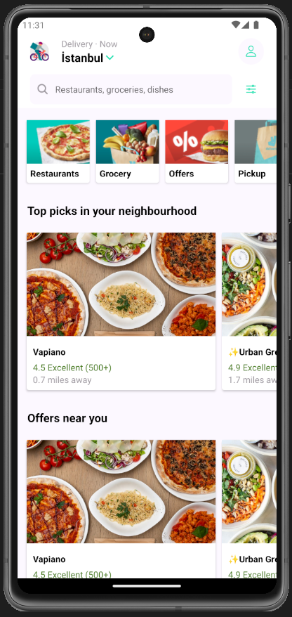
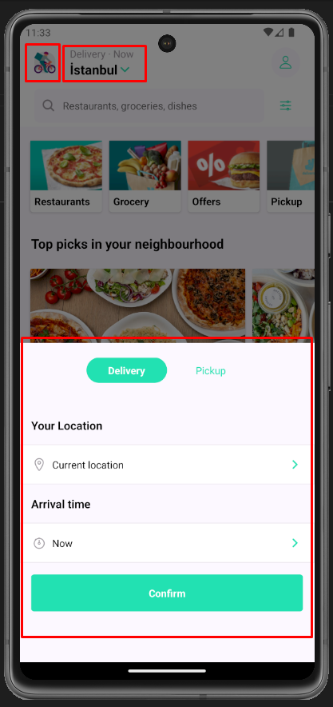
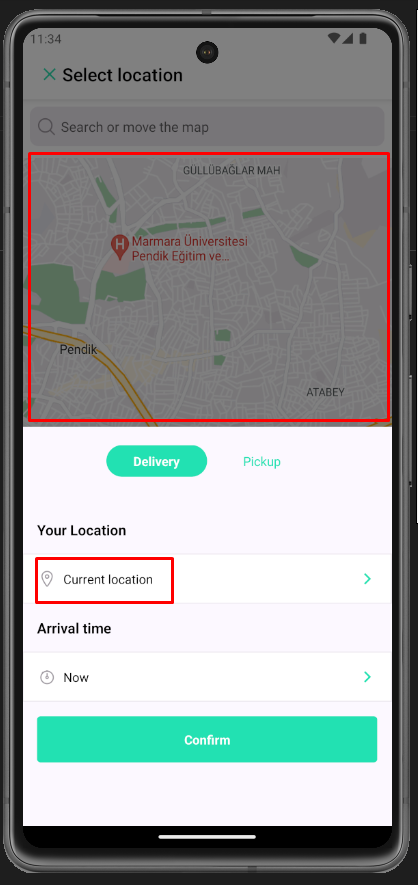
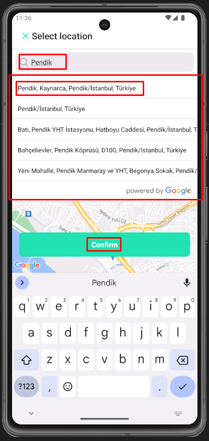
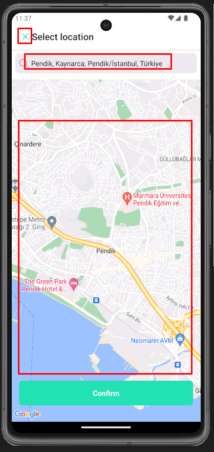
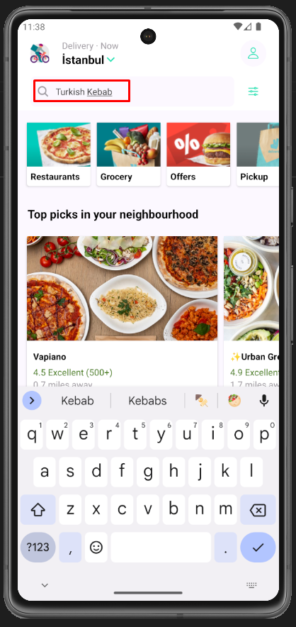
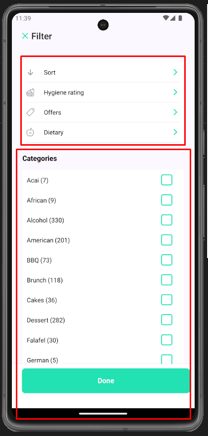
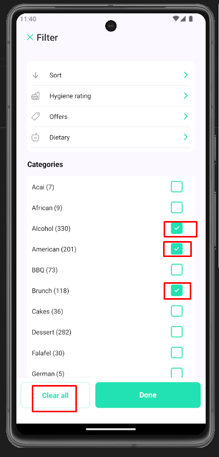
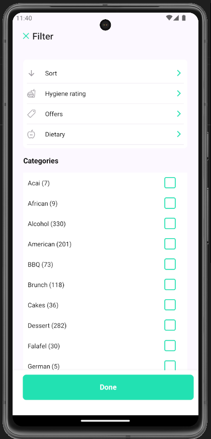
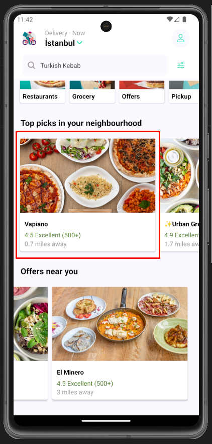
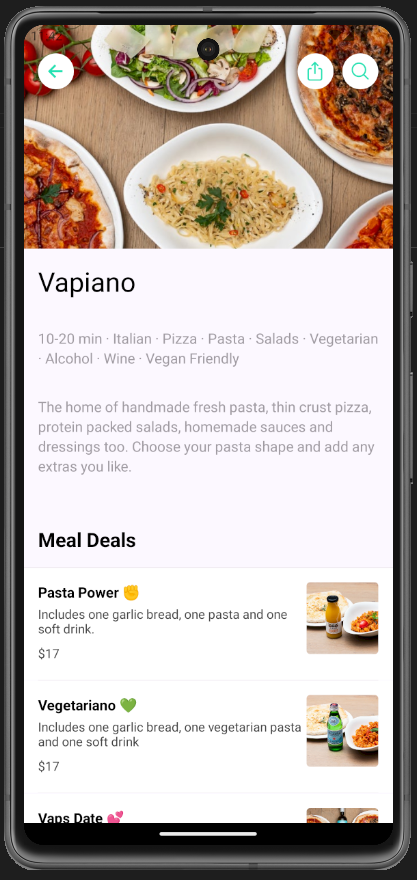
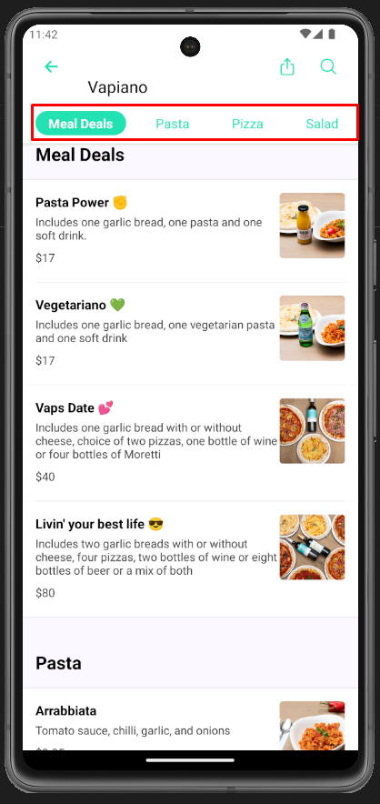
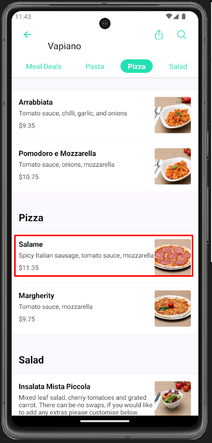
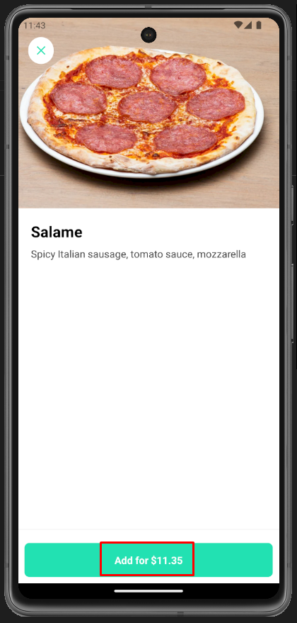
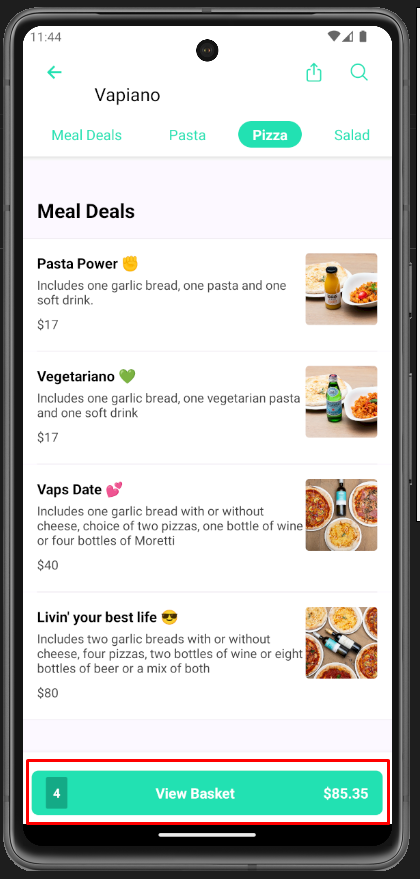
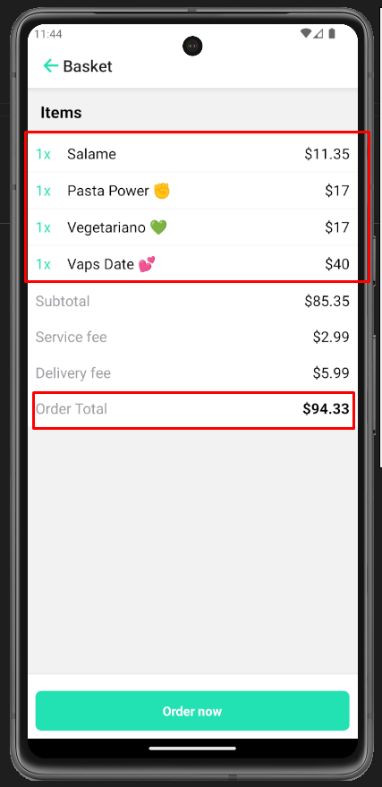
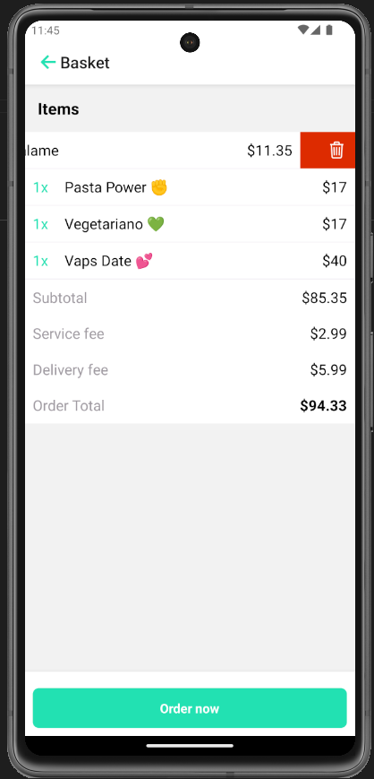
</div>

